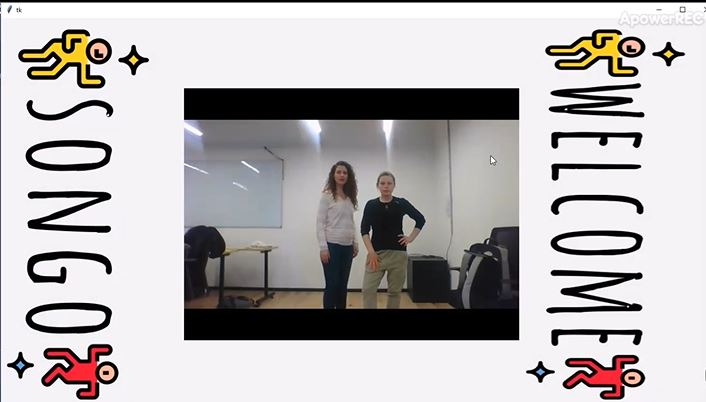
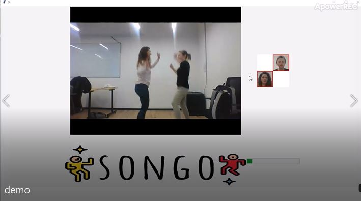
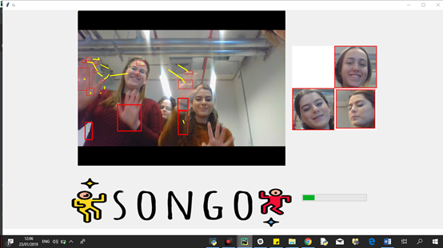
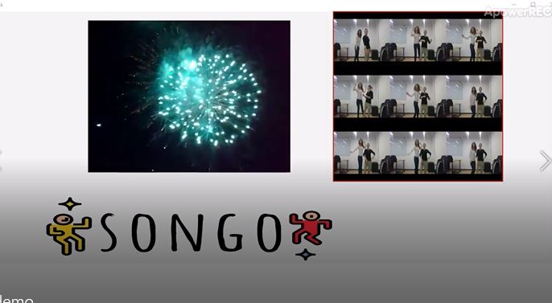

# Songo
Encourages movement and dance in public spaces with music. Using image processing to detect the speed of the players

* Chani Frenkel
* Sari Weisberger
* Chani Zinger

songo can change our world to happier and proactive
## Screenshots

### Prerequisites
* Python 3.7 
* cv2
* Tkinter

### Setup
* Clone this repo from github
* Install dependencies: `pipenv install`

### Run
* To run this project use:

    pipenv run python main.py

(Or just `python main.py` if running in a pipenv shell.)
* let's dance

